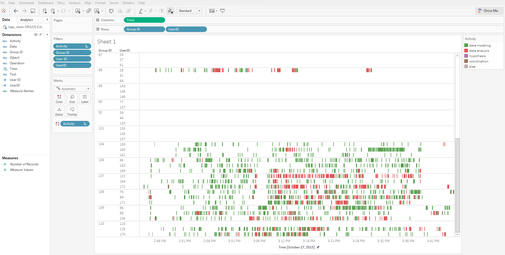
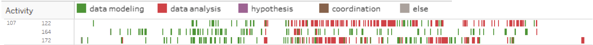

# Visualizing event sequence with Tableau

I used Tableau 10.1

Put Time into column, Group ID and User ID into row. Select `Exact Time` on `Time`. Recode `Tool` to `Activity`, based on the following rule:

document -> data modeling
timeline, network, map, table -> data analysis
notepad -> hypothesis
message, history -> coordination

Then put `Activity` to color

