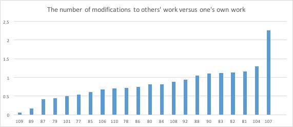
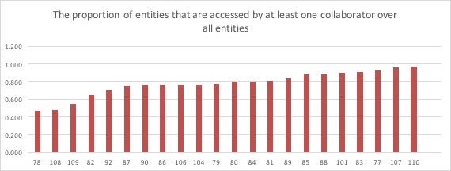
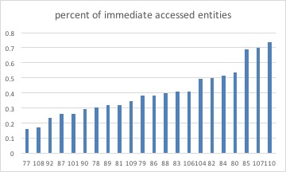
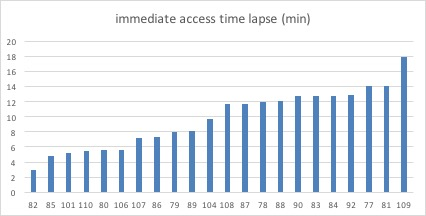
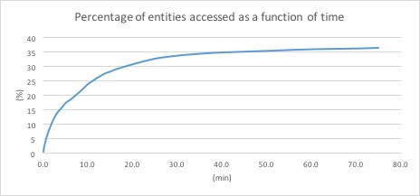

# Social interaction

## Data analysis

We counted the number of these operations in each team:

- create entity/relationship of own （`create_self`)
- create relationship that takes reference to an entity created by others (`create_other`)
- edit (update/delete/restore) entity/relationship/annotation of own (`edit_self`)
- edit entity/relationship/annotation of others (`edit_other`)
- read entity/relationship of own (`read_self`)
- read entity/relationship of others (`read_other`)

One thing to notice is the annotation. When creating or reading an annotation, we count the operation as creating or reading an entity/relationship. Since creating/reading entity is already counted, we dismiss these operations on annotation. But when deleting an annotation, we count the operation as modifying entity in addition to the operation of deleting an entity. That is because deleting an annotation is different from deleting an entity; deleting an annotation essentially modifies an attribute of an entity--deletes a link between an entity and its source document.

## Territoriality

Participants may avoid editing or deleting others' work because they feel uncomfortable editing others' work, a phenomenon known as territoriality. To test if territoriality exists, we measured the number of modifications (including editing and deletions) to others' work versus one's own work.

<!-- data: ./territoriality.xlsx -->

We found that the measure of territoriality varied significantly (from .06 to 2.26). Specifically, Team 107 and Team 104 had highest values, and these two teams happened to be the highest performance team.

## Awareness

Data generated by individuals are automatically shared in CAnaytics. However, it is up to collaborators to choose to read the shared information to stay aware or ignore information altogether. A high awareness team would keep updated with collaborators' generated information and read information soon after it is shared; whereas a low awareness team might read collaborator's information long after it was generated, or even never access it. To measure the degree of such information awareness, we measured the number of entities accessed by collaborators versus by the author only, and the time lapse when the entity is first accessed by collaborator since created.

We also defined "immediate accessed" entities, which refers to entities that are accessed within a session (when teams are synchronously interacting together, within 1 hour in this case as each course lasted for one hour). We define the concept because the time lapse of first access could be large because entities are accessed a few days later. These numbers cause bias to the result and are actually meaningless.

<!-- data: ./entity_access_state.xlsx -->
<!-- the formula to calculate immediate access time lapse is -->
<!-- =IF(OR(G2>3600, ISBLANK(G2)), "", G2/60) -->
<!-- where G2 is the general access time -->

We look at the proportion of entities that were accessed by at least one collaborator, and found that most teams shared a high proportion of entities (mean = 77.6%). Exceptions were G78, G108, and G109. G78 and G109 demonstrated similar patterns. They relied upon the notepad and listed key evidence in text. Therefore they actually did not use much of the entity feature in CAnalytics. G108 created a large number of entities but few of them were accessed by teammates. This proved problematic.

The figure [@fig:access_time] shows the proportion of entities accessed as a function of time. 36.5% of entities were accessed within 75 minutes (a class session). 7% of the entities were accessed within 1 min since there were created. 24% of the entities were accessed within 10 min.

We found that most entities were not "immediately" accessed; i.e. seconds after an entity was created. This meant that when seeing a notification, participants did not just stop and check the new entity. This also to some extent confirms that participants did not find the awareness features distracting as reflected from the survey. While most entities were accessed, participants only accessed them when necessary. 

{#fig:access_time}
