# Artifact analysis

1. importance of connector
2. unit of modeling and unit of analysis
3. accretion and filtering strategy

Examining the network views teams created, we found they fell into one of three categories. For example, the network in Figure XX consists of several separate clusters. Each cluster includes several linked nodes, representing information of a robbery, whereas nodes between clusters are not connected. In contrast, some other networks consist of connected clusters. While each cluster is a representation of a robbery, some of them are connected through some evidence node. An example is Figure XX, in which we marked four connectors that link the clusters. These connectors are also key evidence showing these robberies might be committed by the same criminal group. A special case of this category is that all clusters are connected (see Figure XX), and the teams believed that a single group committed all the robberies.

We posit that the reason behind different network views is the different strategies team employed in addressing uncertainty. With separate cluster networks, teams only added *facts* that were literally documented; any inference was excluded. In fact, we found two teams actually took note of similarities between cases in the notepad, which could be used to remind them connections between cases. In other words, these teams put facts and inferences in separate artifacts. One problem with this strategy is that teams may fail to combine information from these two artifacts; some inferences are essential to push analysis forward. On the other extreme, teams that created one big cluster mixed facts and inferences; factual links and inferential relationships are treated equally and influence the layout of the network, and further influencing the picture analysts had in mind. Finally, teams that identified critical connectors weighed the certainty of connections and only add those of least uncertainty to the network. We propose that a richer graphic language should be designed so that analysts can encode uncertainty into the network view. Teams can configure the uncertainty parameter and be reminded to review the uncertainty periodically; links with different uncertainty are presented visually differently.

Finally, a third category of network consists of few links. These networks seemed incomplete, with only a few nodes

From the entities modeled and the network view created, We noted a distinction between accretion and filtering strategies in data modeling, similar to what we observed in the paper prototype study. Accretion is an attempt to comprehensively represent the problem by adding all information to an artifact. Users extract every fact from the document, regardless of its immediate relevance to the problem. Accretion costs less coordination as it is relatively mechanical note taking. A disadvantage of accretion is that it could be time consuming to model all details and the produced artifact could be fairly complex. An example is Team 108, who modeled every step the suspects took, which resulted in many more entities than the average and much more cluttered network view. Users reported that they spent too much time in details that they lost the bigger picture:

> we spent far too much time just entering data. While looking for specific elements to tag in the documents we were unable to see the bigger picture. (User 169)

Filtering is selectively modeling of data and adding to an artifact. Users must decide what information is relevant, and thus what is to be excluded, as well as what granularity of information is to model. Filtering requires more team coordination, because teammates must reach a common ground of the current problem as well as information needed to answer the problem. Figure XX is an example of filtering, highlighting only the key information of each robbery and how robberies are connected.

## Summary of network graphs

The network graph generated by teams can be roughly divided into three categories:

1. Less connected graph

    The network graph only has a few entities, with little connection. The network was "sparse", and seems not useful. However, these teams performed very well, which poses an interesting question as to why and how?

    Examples: G110 (6.5), G80 (7), G81 (7), G106 (7.5), G109 (11), G78 (12.5)

    Summary: 6 teams did not use much network, and their average report score was 8.58

    A possible explanation is that these teams finished report writing before they well constructed their network. They used the tool only as external memory.

    Methods to identify indicators to support the argument:

    1. Read their report to find if anything is related to the network
    2. Check when they started working on the hypothesis. They might start working on hypothesis earlier in the stage that they did not need to finish creating network

      From the action sequence graph, we can see these teams started working on the notepad early: G78, G106, G81

      The other teams (G109, G80, G110) did not work on notepad until phase 3.

    3. Check their questionnaire and see if they had any negative feedback. There is also possibility that they abandoned the tool completely and used other tools to solve the problem, resulting the incomplete graph.

2. Separate clusters

    The network has information in each document as a cluster, and information in different documents is not linked.

    Examples: G86 (4.5), G82 (5), G83 (6), G88 (6), G90 (9), G108 (9), G87 (9.5), G104 (14)

    Summary: 8 teams created this type of network, and their average performance was 7.88

3. Connected clusters

    Information in each document forms into a cluster, but teams are able to identify connectors between cases to link them together.

    Examples: G101 (6), G89 (6.5), G85 (7.5), G92 (8), G77 (9.5), G107 (12.5)

    Summary: 6 teams created this type of network, and their average performance was 8.3

  1. One big cluster

      A special case of connected clusters are one big cluster; all clusters are connected through a single (suspect) node.

      Examples: G79 (1.5), G84 (6)

      Summary: 2 teams created one big cluster in the network and their average performance was 3.75

## Detail

G79 performed bad (1.5) probably because in the network they linked all cases to one suspect. This is an example that wrong inferences could lead to group think.

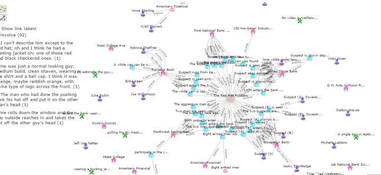

G86 performed bad (4.5), but their network view looks clear. However, compared to G107's network, their network is missing "key" connectors between node clusters, for example, they missed the resource "van" that connects the robbery of citizen's bank and the robbery of Reliance Bank.

Another signal is that G86's awareness is low, which is proved by their shared entities: only 19% of entities were accessed by all collaborators (although 76.2% of entities were accessed by at least one collaborator, which is not bad).

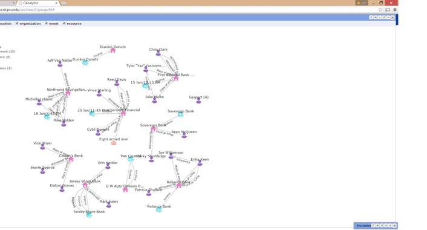

G82 performed bad, and their network view is similar to G86's. They created several disconnected clusters. They missed the key connectors that link the cases. The difference is that G82 had high levels of awareness according to log. They had over 60% (second highest) shared entities by three collaborators, and they actively edited collaborators' work.

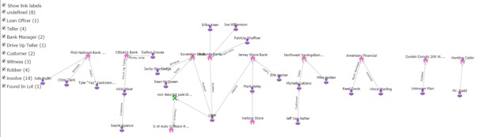

G83 scored 6. Their network view is close to G82 and G86, in that they created several disconnected clusters. G83 had a relatively high percent of shared entities by two collaborators.
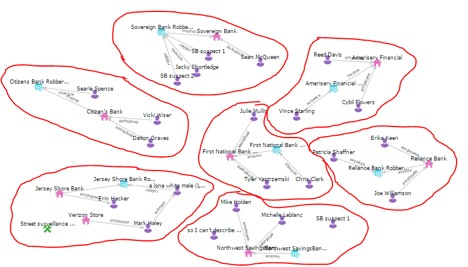

Similarly, G88 created several clustered network.
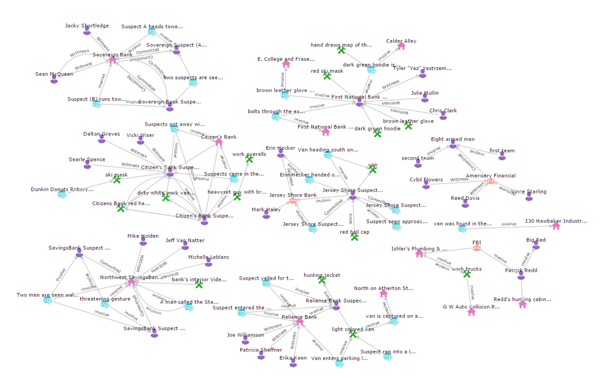

G101 created a link between citizen's bank and Big Red.

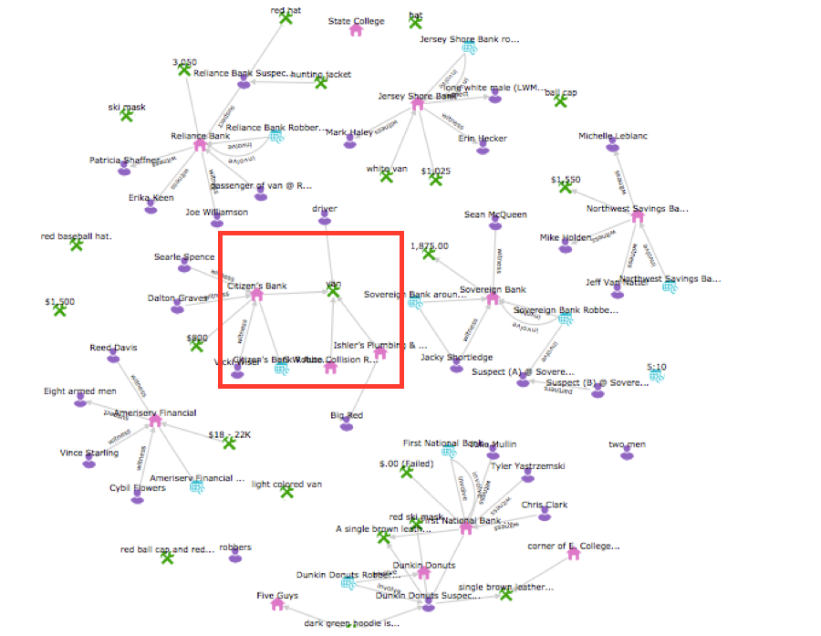

G84's network is similar to G79's, in which they connected all cases to the same suspect. The difference is that G79's network is more sparse

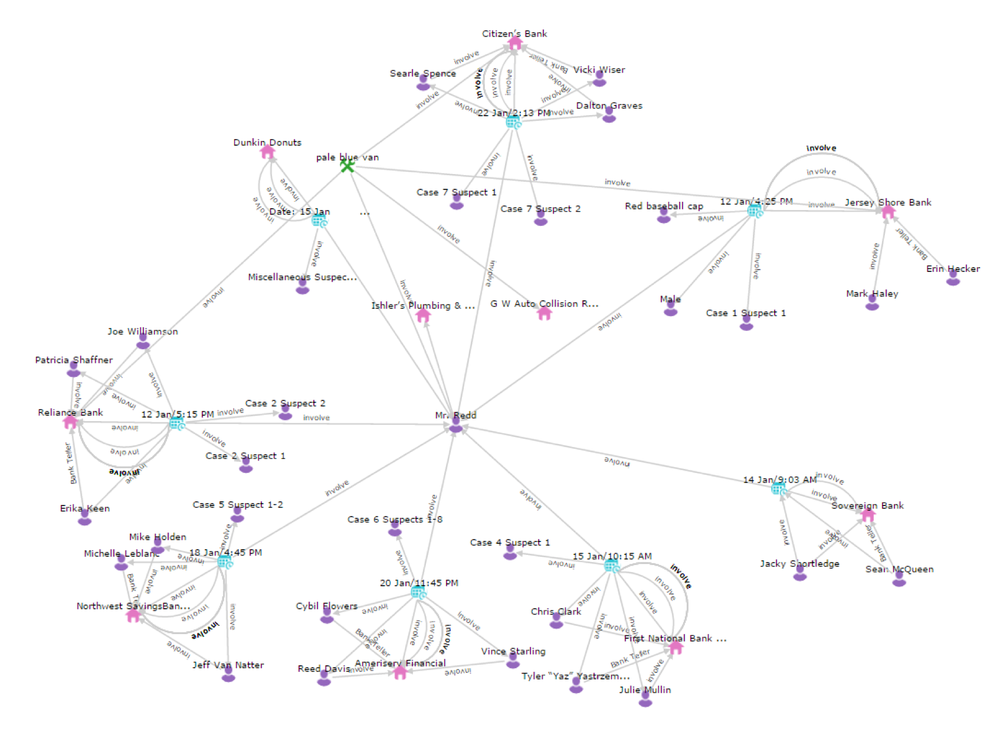

G89's network has two connected clusters

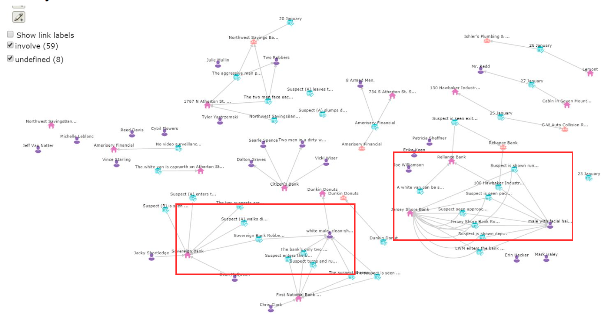

G110 did not create a useful network

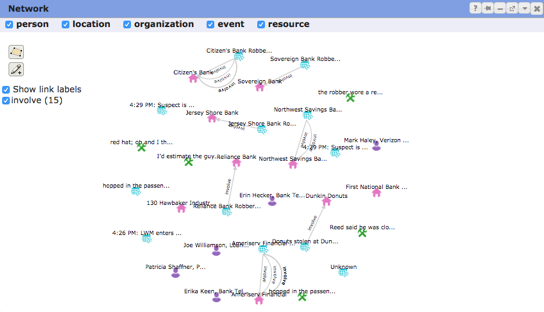

G80 did not create a useful network

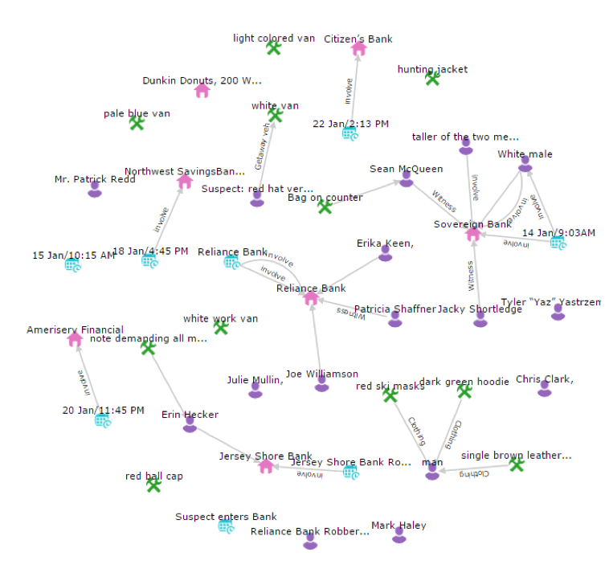

G81 did not create a useful network

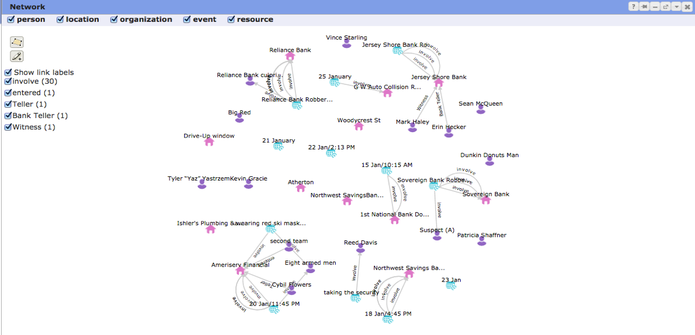

G85 connected four cases to a suspect based on the description "LWM"

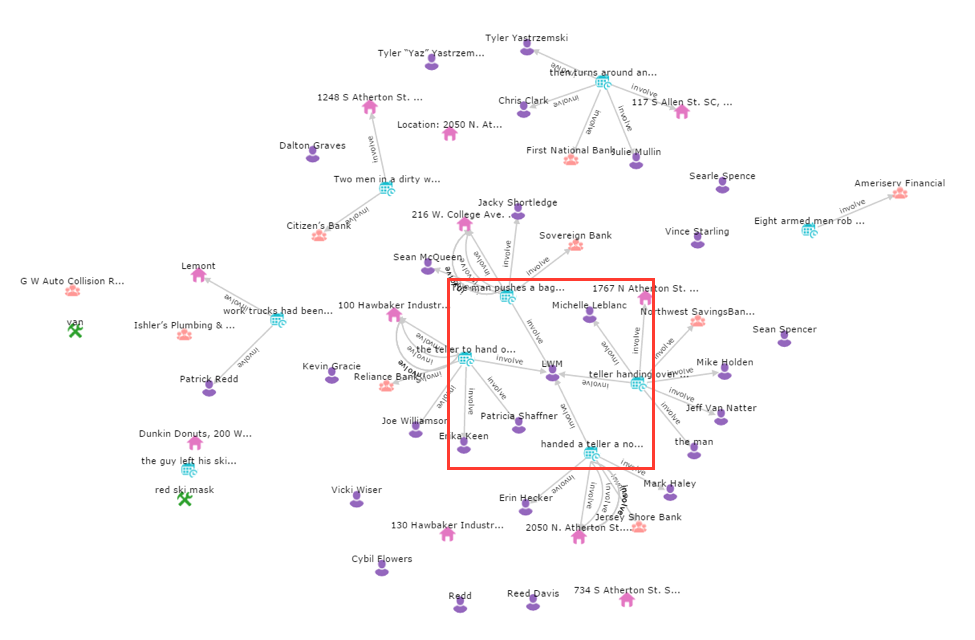

G106 did not attach their network because they did not believe the tool helped them, although their usage of the tool is normal according to the log.

G92 identified two connectors. The first connector "mask" (false connector) connected four cases. The second connector, the "van", connected three cases.

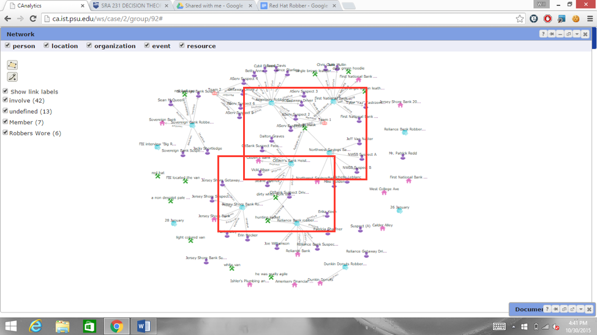

G77 identified four connectors. They identified the "van". They also connected two cases by same action performed by the suspect. Another connector is the pattern the robbery was conducted: both cases were robbed by "two men". Since such pattern cannot be directly represented in the network, the team created a "person" node and linked both cases to the node. Finally, they connected two cases by co-occurrence in a document. This literal relationship actually did not help the team; however, it is worth noting that the literal co-occurrence relationship is often modeled in other visualization tools (e.g. Jigsaw).

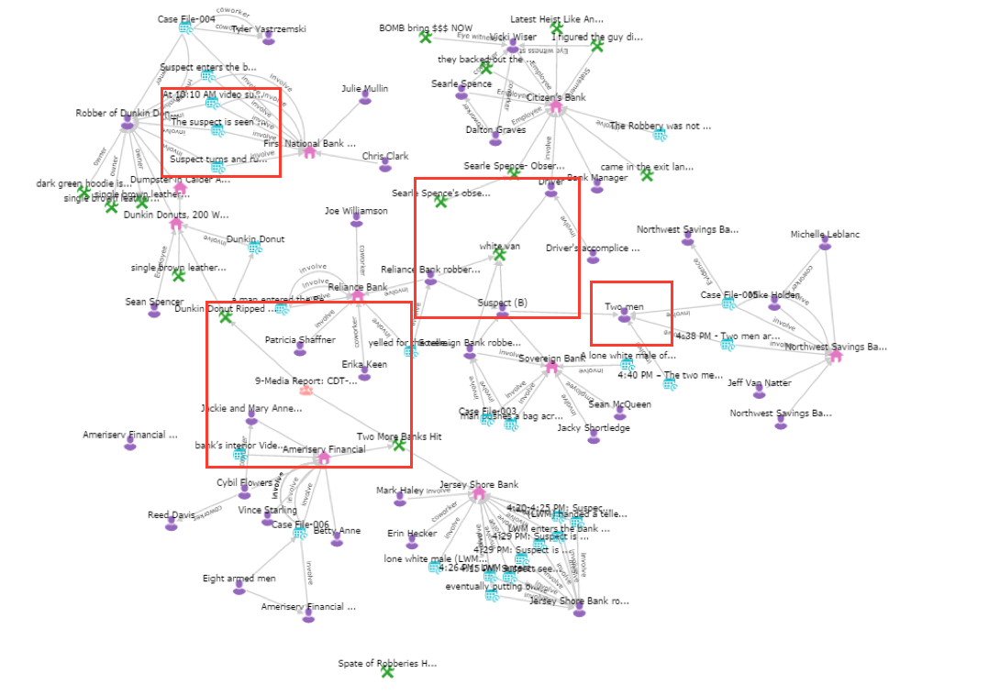

G90 created separate clusters.

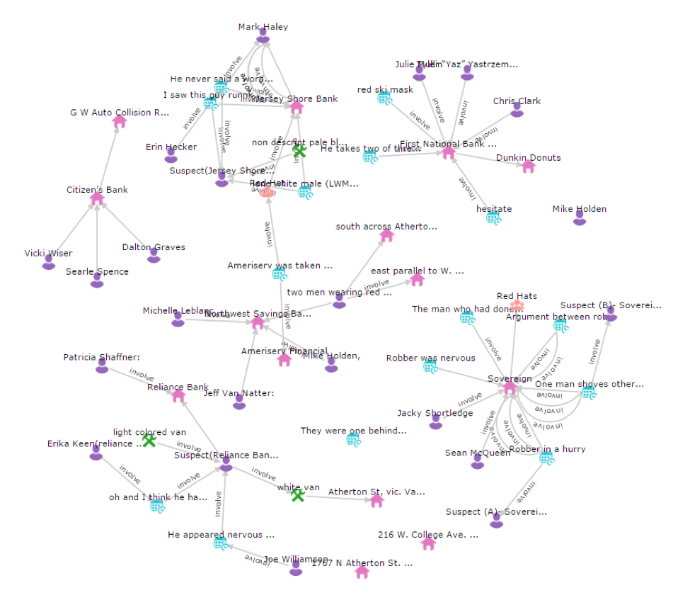

G108 created separate clusters (with one connector). They created many entities in the network. When looking into the graph, we found that the team extracted all detailed information in the documents, whether related or unrelated, including co-occurrence relationships. For example, they created nodes for documents and linked documents with entities that showed up in the documents.

G87 created separate clusters.

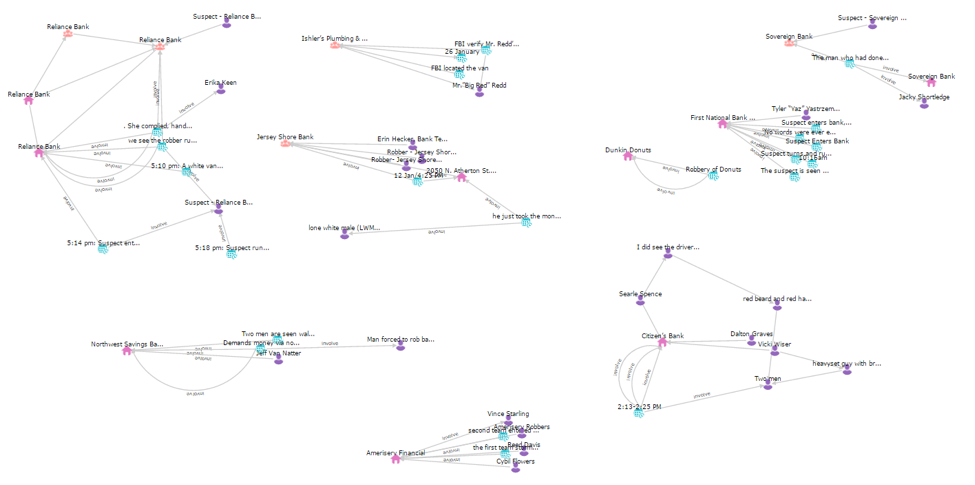

G109 created few links, indicating that they did not use much of the network.

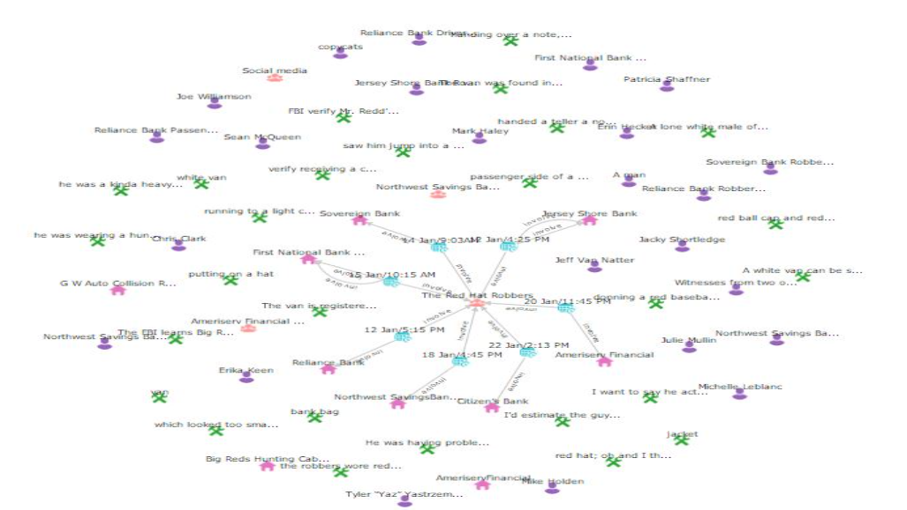

G78 did not use much of network

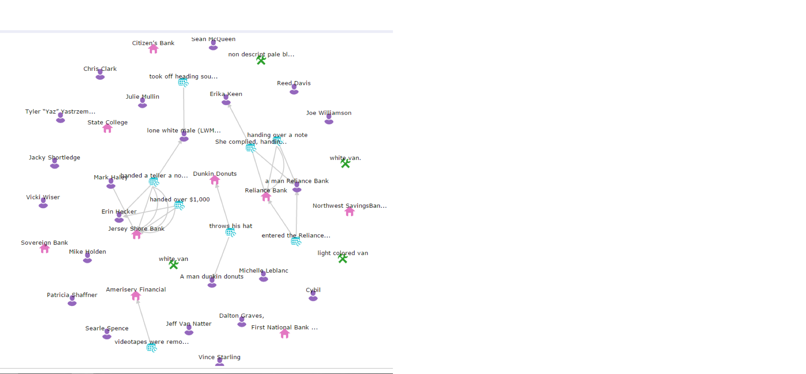

G107 identified several connectors. They identified "van". They made an inference that "Patrick" was involved with Case Citizen's Bank. They connected three cases together through the same description of a "lone white man". They identified that two cases shared the same pattern that one suspect was threatened by another suspect. Finally they connected two cases through a suspect with similar outlook descriptions. Also worth note that, the team identified more than one connector between cases, which indicated that the team sought for extra confirmation for their hypotheses. For example, Case Northwest Bank and Sovereion Bank were connected by both the 'LWM' and "suspect A".

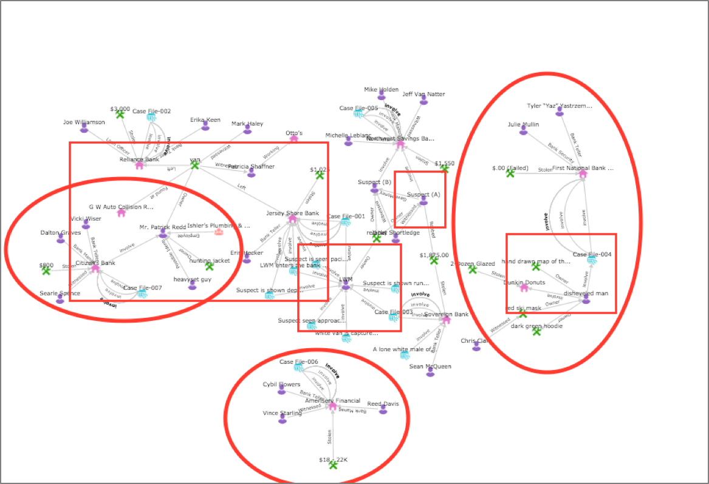

G104 created separate clusters. However, their team used the chat tool and discussed about hypotheses.

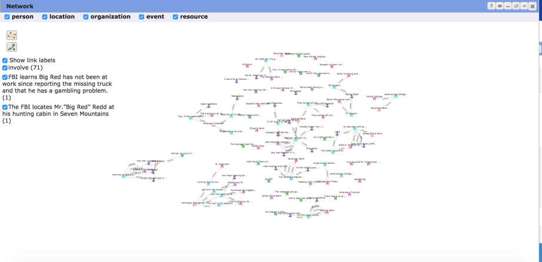
