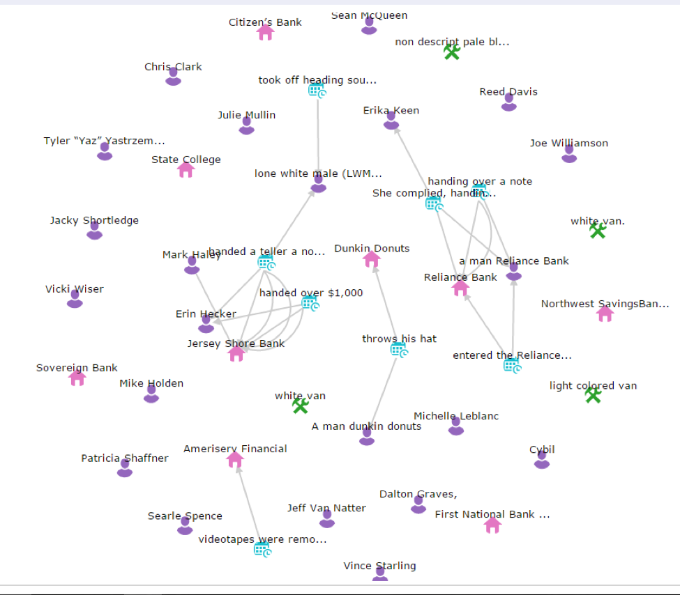

# G78

G78 performed well and scored 12.5 in the team report. However, from the log analysis, G78 did not outstand.

Their network is sparse. Few links were created.

- They created 43 entities, but only 20 entities were accessed by at least one other collaborator (46.5%, the worst in all teams; for comparison, the average is 77.6%, and the highest is 97.1%).

However, they made a detailed list of key information in each case. We hypothesized that the list helped the team organize and summarize the useful information.

# G109

G109 did similar to G78. The created 75 entities, but only 41 entities were accessed by another person apart from the author. Their network view was sparse, but they relied on the notepad and created a list of key evidence for each case.
