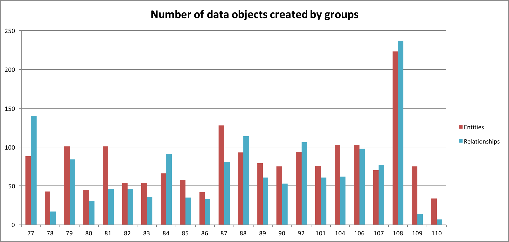

# Information collection

## collection strategy

From the teams' report and their created network graphs, we identified two different information collection strategies: accretion and filtering. Accretion is successively adding information

Characteristics of accretion strategies: the team reported their findings case by case. The network view contains every fact the team identified.

Characteristics of filtering: the report is organized by leading questions, followed by evidence supporting the question. The network only contains relevant entities

### Accretion

G78, G79, G86, G101 (do in IEW), G104, G108, G109

### Filtering

G77, G80, G81, G82, G83, G84, G87, G88, G89, G110

Uncertain

G83, G85, G90, G92, G106, G107
