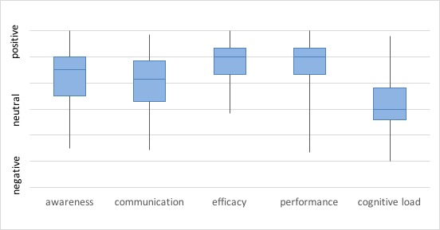

# Survey

The survey asked people about how they experienced when using CAnalytics, in terms of awareness, team communication, team efficacy, team coherence, perceived team performance, and cognitive load.

<!-- TODO: explain these variables -->

The results are summarized in the figure. CAnalytics were ranked favorably in all aspects except cognitive load. This indicates that participants had an overall pleasant experience using CAnalytics. They had a close to neutral feeling towards cognitive load, which suggests that the task is still cognitive heavy.
