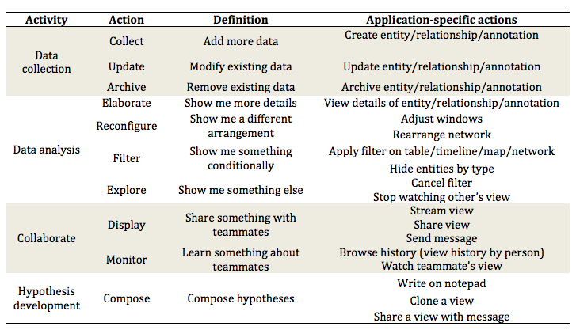

# System log

Mapping between application-specific actions to general actions

Adapt the action taxonomy from [Guo et al. 2016][1] and [Yi et al. 2007][2]

[Brown et al. 2014] applied machine learning to user interaction logs to model users (predict performance and characterize user trait). Below is the literature review part of their paper:

> Many systems have been developed in the visual analytics community for logging, storing, and analyzing a user’s interactions and activities. For example, the GlassBox system by Cowley et al. [9] records low-level events generated by the interface (such as copy, paste, window activation, etc.). At a higher level, VisTrails captures the user’s steps in a scientific workflow [3]. Finally, at a model level, Endert et al. showed that user interactions can be analyzed systematically, and directly used to perform model steering operations [13]. Similarly, other researchers have demonstrated that a user’s interactions can be used to infer parameters of analytical models, which can then be presented visually [4, 15, 44]. Our work shares synergistic activities with these prior works in that we also seek to extract higher-level information from low-level user interactions. However, our goal is to develop techniques that can automatically classify users on their characteristics

Both [Guo et al. 2016][1] and [Brown et al. 2014][3] mentioned three types of interaction analysis:
- state-based analysis
- event-based analysis (a single transition between states)
- sequence-based analysis (sequence of transitions)

[1] Guo, H. et al. 2016. A Case Study Using Visualization Interaction Logs and Insight Metrics to Understand How Analysts Arrive at Insights. IEEE Transactions on Visualization and Computer Graphics. 22, 1 (2016), 51–60.
[2] J. S. Yi, Y. ah Kang, J. T. Stasko, and J. A. Jacko. Toward a deeper understanding of the role of interaction in information visualization. Visualiza- tion and Computer Graphics, IEEE Transactions on, 13(6):1224–1231, 2007.
[3] Brown, E.T. et al. 2014. Finding waldo: Learning about users from their interactions. IEEE Transactions on Visualization and Computer Graphics. 20, 12 (2014), 1663–1672.
