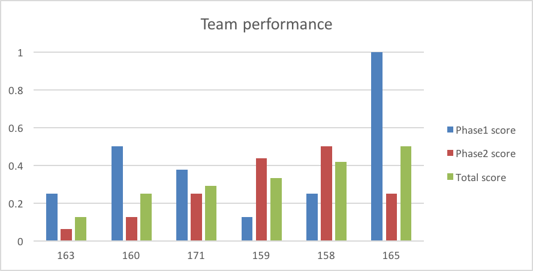

# Performance

{#fig:performance}

The average normalized score for Task Phase One was 0.42, and the average normalized score for Task Phase Two was 0.27, and average total was 0.32. This indicated that the task was difficult. 
