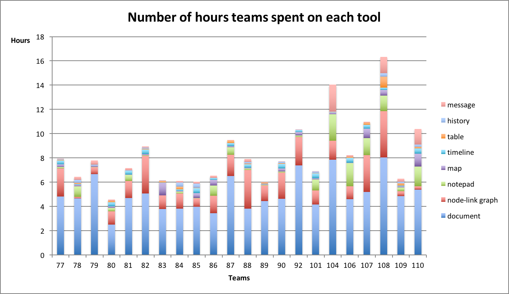

# Tool usage

We summarized the time each team spent on tools in CAnalytics throughout the study. The total time spent on CAnalytics varied by teams, from over 4 hours to over 16 hours, with average = 8.28h, standard deviation = 2.79h.

<!-- TODO: find patterns of individual efforts distribution -->

We also summarized the time each individual spent in a team, in an attempt to identify how the efforts distributed in teams. More investigation needs to be done to identify patterns.
