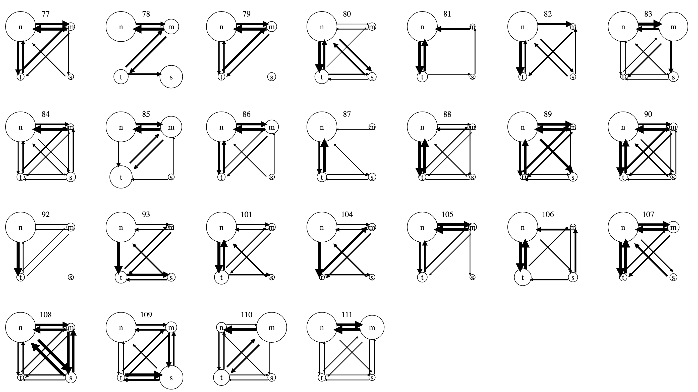
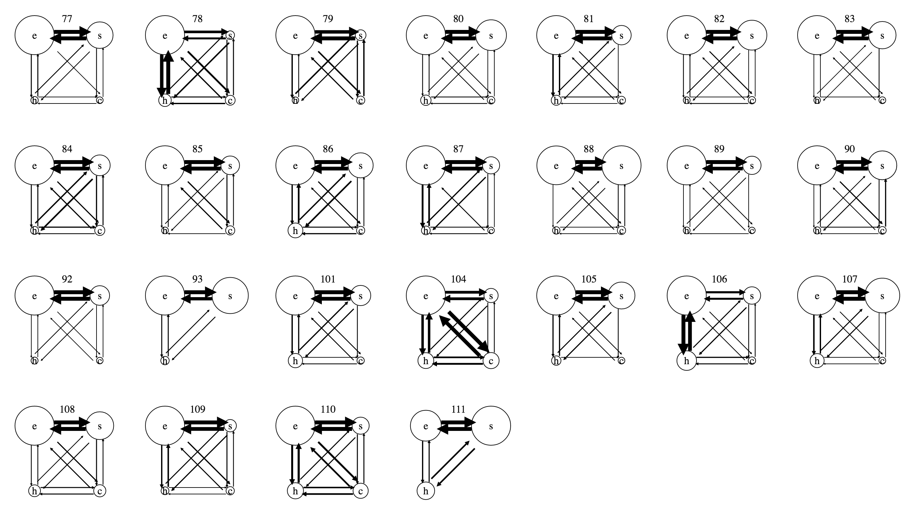

# Analytic state transition

Inspired by Luke Zhang [1], we may look into behavior pattern by examining transition between behaviors; that is, the frequency of transitioning from one behavior to another. Specifically, we can look at two levels: tool level and activity level.

On the tool level, we visualize each tool as a node, with time usage on tools as node size. Directed links between tools encode transition, with width of links representing frequency of transitions. We could probably see patterns of tool usage between and within high performance teams and low performance teams.

The result is displayed in the chart ('n' stands for node-link graph, 'm' for map, 't' for timeline, and 's' for spreadsheet/table)

On the activity level, we interpret different tool usage as different analytic activities: document/annotation tool for evidence collection, visualization tool for evidence schematization, notepad tool for hypothesis generation, and message/history tool for overall coordination. Similar to visualization of tool transition, we encode each activity as a node, with time spent on each activity as node size. Direct links between nodes encode transition between activities, with width representing frequency of transitions. We could probably see patterns of activity transition between and within high performance teams and low performance teams.

The result is displayed in the chart ('e' stands for evidence collection, 's' for schematization, 'h' for hypothesis, and 'c' for coordination)

Question: how to interpret the chart?

Wolf D, Hyland J, Simpson TW, Zhang X. The Importance of Training for Interactive Trade Space Exploration: A Study of Novice and Expert Users. ASME. J. Comput. Inf. Sci. Eng. 2011;11(3):031009-031009-11. doi:10.1115/1.3615685.
