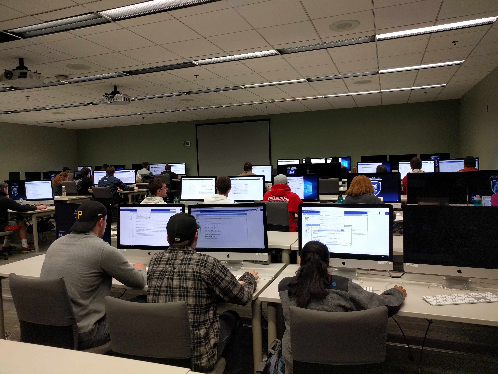

# Classroom Study Settings

We deployed CAnalytics in SRA 468, a course in the major of Security and Risk Analysis at Pennsylvania State University that is designed to teach senior undergraduate students about application of visual analysis in the domain of intelligence analysis.

The study began in the later phase of the course, when students had learnt about common techniques of visual analytics, such as time series analysis, tree-based data analysis, and network analysis, as well as popular tools like ArcGIS and Tableau. With such equipment of basic visualization knowledge, from Nov 7 to Nov 18, we introduced CAnalytics and asked students to use the tool to solve a relatively complex task.

Students were first given a tutorial, in which students were guided step by step to use CAnalytics features to solve a simplified task. The students then had two full classes to do the project, each class lasting for 50 minutes. Due to the complexity of the task, students were asked to work for extra hours outside class. In total, 30 students (10 teams) participated in our study

<!-- TODO: task description. e.g. the task consists of ?? pieces of information -->
The task used in the study was a carefully fabricated laptop theft scenario. The task has been used and validated in our earlier user studies (cite??). The task consisted of 222 pieces of information, involving social media data, bank transactions, suspect interviews, and other records. Teammates were randomly assigned one of the three roles and were responsible for a unique set of documents: a Web Analyst had social media data and would contribute mostly on social relationships; a Record Analyst had archival information about suspects' daily schedules and could contribute by providing locations of suspects when theft occurred; and an Interview Analyst had interview data from people of interest and could likely contribute by identifying the motivation of suspects. To reach the right conclusion, teams had to share their unique information sufficiently. Students were told not to share documents directly but they could share their information by creating data annotations in CAnalytics.

