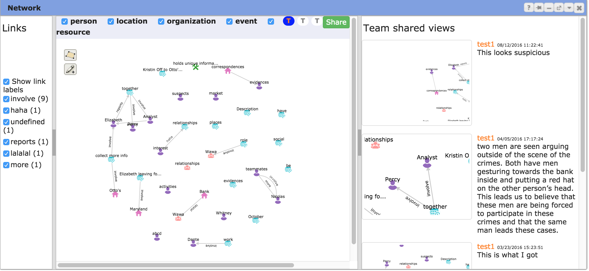
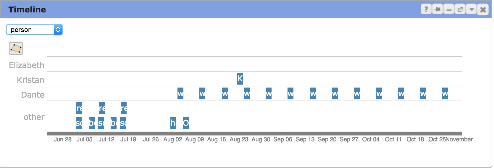

# Study Design

## Classroom setting

SRA 468: Visual Analytics for Security Intelligence

Student number: about 40

Team: 3 students in one team

Time: Week 12 (11/7, 11/9) and 13 (11/14, 11/16) (4 classes, 50 min for each class)

## Task: Campus theft

11/7: Tutorial (TODO: design tutorial)

11/9: Task Phase One

11/14: Task Phase Two

11/16: Task Phase Three

QUESTION: When to submit report? Before the next class?

## Changes to CAnalytics

1. Add view sharing, watching, cloning, and restoring

  

---

2. Timeline can be further schematized by person, location, etc.

  

---

3. Replace Django/Node with Express.js for server

4. Fix bugs (filter, data synchronization)

## Measure

### Survey

1. Pre survey

  Prior experience with CAnalytics (QUESTION: what if students have used CAnalytics before?)

2. Post survey

  Same with prior Study

  Add recall questions

3. Mid survey

  Add recall questions

### System log

Add log to view sharing

Add log to history
