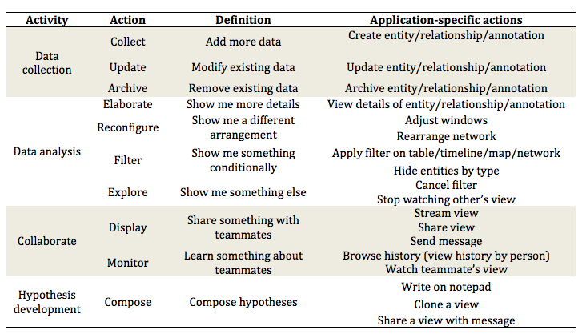

# System log

Mapping between application-specific actions to general actions

Adapt the action taxonomy from Guo et al. (2016) and Yi et al. (2007)

[1] Guo, H. et al. 2016. A Case Study Using Visualization Interaction Logs and Insight Metrics to Understand How Analysts Arrive at Insights. IEEE Transactions on Visualization and Computer Graphics. 22, 1 (2016), 51–60.
[2] J. S. Yi, Y. ah Kang, J. T. Stasko, and J. A. Jacko. Toward a deeper under- standing of the role of interaction in information visualization. Visualiza- tion and Computer Graphics, IEEE Transactions on, 13(6):1224–1231, 2007.
