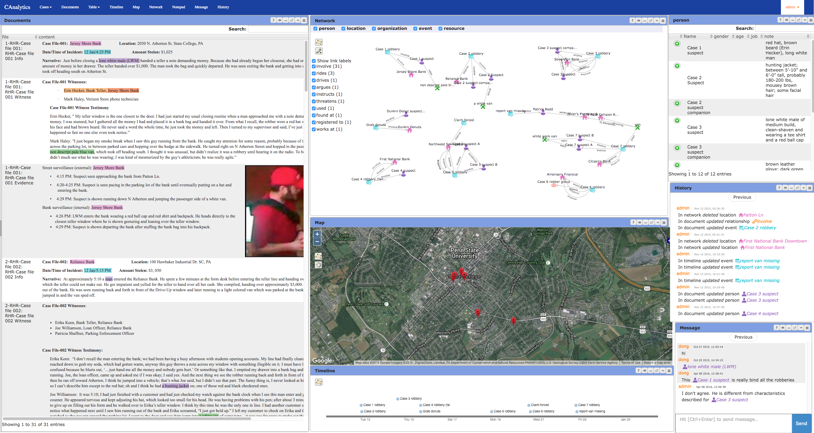

# CAnalytics Tutorial

## Overview

CAnalytics is a web application to support collaborative information analysis.

Key features:
- Integrated support for data collection, data analysis, and hypothesis development.
- Real time sharing of data and views in teams. 
